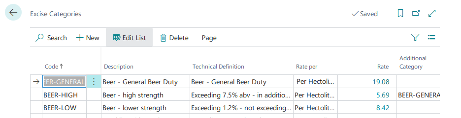
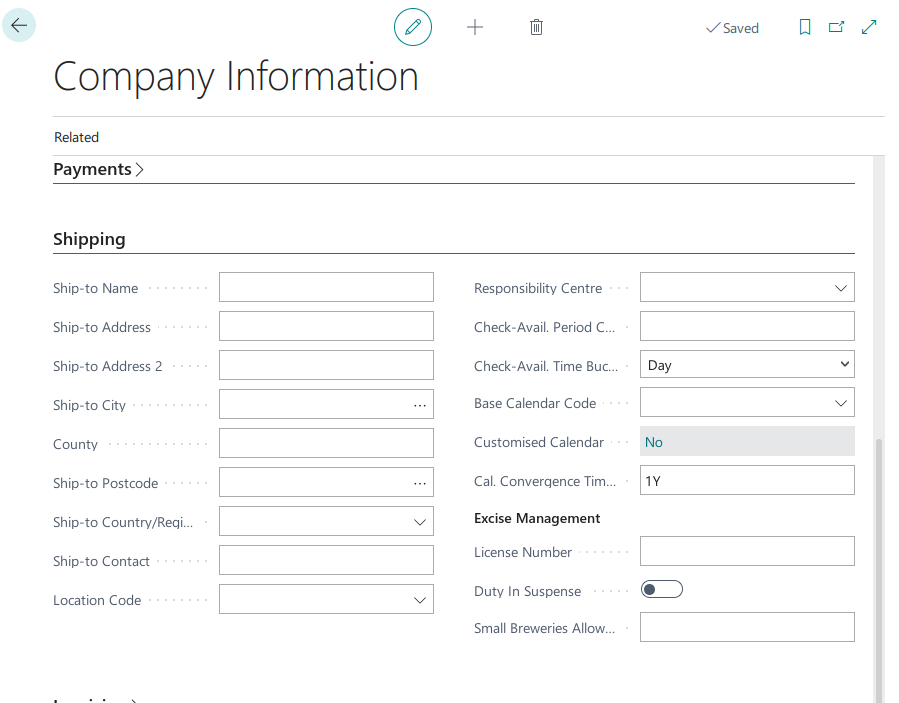
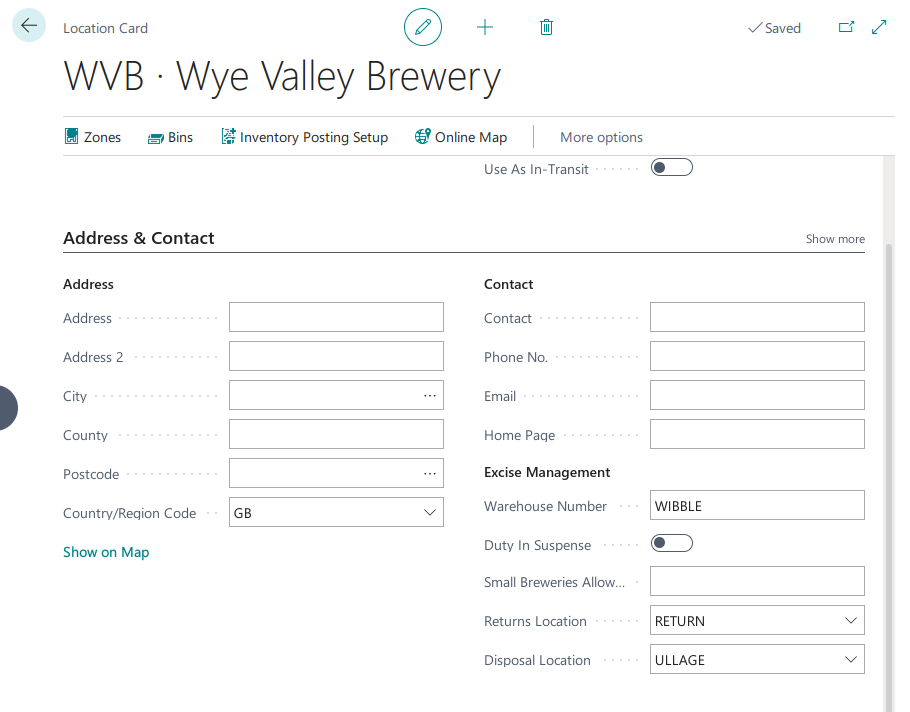
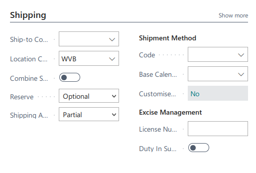
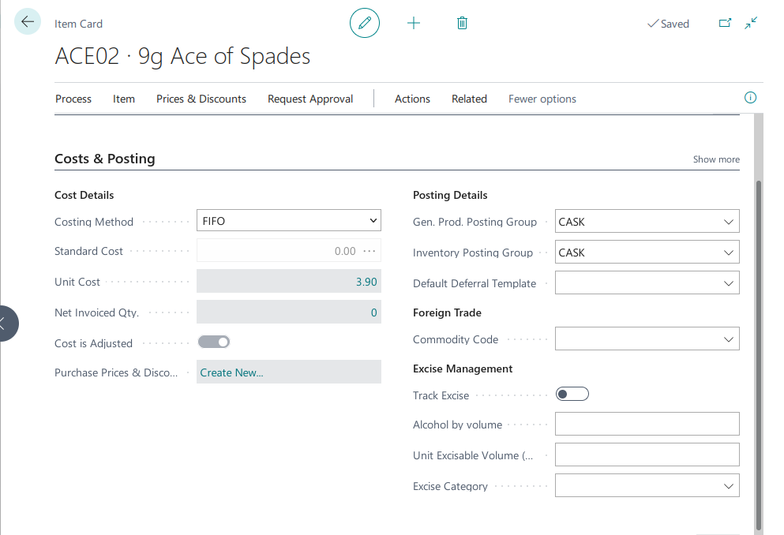

### Excise Management 
___

#### Bookkeeping
the following accounts are defined

- Excise Liability account - the excise to be paid to HMRC
- Excise Asset Account - the amount of excise recognised relating to inventory. 
- Excise Cost Account - the Excise element of cost of goods sold. 

In a bonded location no there is no journal for inbound transactions. 
For outbound transactions the journal will be  
Dr Excise Cost Account x  
&nbsp; Cr Excise Liability Account	x

In a non-bonded location excise will be accounted on arrival and departure. 
If the arrival does not relate to a transfer (Output or +ve adjustment) the journal will be  
Dr	 Excise Asset	x  
&nbsp; Cr Excise Liability	x

Upon any outbound transaction (sale or stock adjustment) the journal will be  
Dr	Excise Cost Acocunt	x  
&nbsp; Cr Excise Asset account	x  

If the stock is transfered from a bonded location to a non-bonded location the journal will be  
Dr Excise Asset Accout	x  
&nbsp; Cr	 Excise Liability Account	x  

Transfers from non-bonded to bonded locations are disallowed and will cause a user error to occur. 

#### Setup
##### Excise Setup
- Excise Liability account - this is the balance sheet account which stores excise due to HMRC. 
- Excise Asset Account - this account stores the value of excise that has been paid on product that is currently in inventory. 
- Non-conformance No. Series - Numbering for product returns. A non-conformance us used to track beer from a return to its destruction. 

##### General posting Setup
- Excise Cost account - the account used for the cost of excise to the business.

##### Excise Categories. 
Excise categories will be set up automatically based on the latest information from HMRC.

##### Excise Reduction Codes.
If the company benefits from a reduction in Excise (e.g. Small Brewers allowance) then an excise reduction code can be created and assigned to items. This will reduce the rate of Excise payable. 

##### Company Information
On the Company information page, Shipping tab in the Excise Management group.

- License number - the bonded warehouse (if any). If this field is filled the business is treated as a bonded location for excise purposes and so excise will only be due when product leaves the premisis. This is superceded by the number on the location if multiple locations are in use. 
- Duty in suspense - enable this if Duty in suspense shipments are made from the premises. 
- Small Brewers Allowance - enter the small brewers allowance % here if applicable. 

##### Location card

In the Excise Management group 
- Warehouse number - bonded warehouse number for this location. If filled the location will be treated as a duty free area. 
- Small brewers allowance - Percentage of small brewers allowance - overrides the setting on Company Information. 
- Returns Location - Specifies the location to which beer is returned. This will be a duty paid area. 
- Disposal location - the location in to which beer is transferred when awaiting disposal. 

#### Customer & Vendor cards

The same settings exist on both the customer and Vendor cards. 
If the customer operates a bonded warehouse then you can enter their license number here. this will allow for Sales on a Duty in Suspense basis. 

##### Item Card

in the Costs & Posting tab there is the Excise Management group. 
- Track  Excise - when enabled Excise will be calculated and tracked for this item. 
- Alcohol by volume - enter the ABV % for the product. 
- Unit Excisable Volume (L) - the volume of product in lires net of any allowances for sediment (cask bottom allowance)
- Excise Category - the category of the product for excise purposes. 
- Excise Reduction Rate - the excise rate can be reduced using a reduction code. 

#### Processing. 
If "Track Excise" is enabled on an item then an excise entry will be generated whenever this product is moved. These entries can be viewed from the item card using Related - History

##### Output / Positive stock adjustments. 
For excise purposes the output will be treated as coming from a pre-duty location so not triggering an excise liability if the goods are booked into a pre-duty location. The Warehouse number assigned will be "Output"

##### Sales
If the goods are shipped from a pre-duty location then an excise liability will be triggered. The excise amount will be visible in the item ledger entry "Excise Amount" field so as to be reflected in teh profitability analysis. 

##### Transfers orders.
If stock is to be transferred to a pre-duty location (eg a bonded warehouse where a customer holds consignment stock) and the transfer is to be made Duty in Suspense then a Transit location for Duty in suspense should be used. A suggested setup is below.

The "Direct Transfer" option is not supported for Duty in Suspense transfers. This is because the system uses the blank location which cannot be marked as pre-duty. 

##### Item Reclassification
the Item Reclassification journal can be used for simple stock movements - for example for beer that has failed delivery it should be moved from the Main location to the Returns location. 

#### Disposals
If duty-paid cask beer is returned to WVB for disposal the transaction must be recorded and duty may be re-claimed for the unconsumed portion of the cask. 

The Disposal should be recorded as an Excise Non-Conformance. 

##### Setup
Enter a non-conformance entry number series on Excise Setup.

Create Fault Codes (e.g. Cloudy, Bitter, etc)

##### Usage
Upon receiving a complaint of faulty product an Excise non-conformance should be created. This can be done either directly (Excise non-conformances) or from the sales shipment or return order. 

- From the posted sales shipment - select the line with a fault and choose (Line) functions - Create Non-conformance. 

If the non-conformance was not created from a return order you can create the return order from the non-conformance. 

When the return order is received the product will be directly written off from stock as it is non-saleable. 